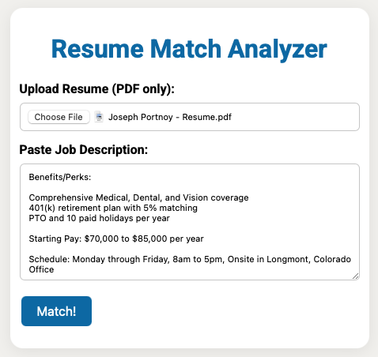
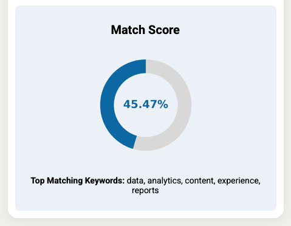

# Resume-Match-ML

A machine learning-powered application that compares resumes to job descriptions and returns a percentage match score. Built using NLP (SBERT), Flask, and front-end visualizations, this project helps users evaluate how well their resume aligns with a job posting.

🟢 **Live App:** [https://resume-match-ml.onrender.com/](https://resume-match-ml.onrender.com/)

🟢 **Class Presentation:** [https://docs.google.com/presentation/d/1TJ4_YpCQgWk0owylhfRwUWbXCkF2O2HkYjzHC5EIIik/edit?usp=sharing](https://docs.google.com/presentation/d/1TJ4_YpCQgWk0owylhfRwUWbXCkF2O2HkYjzHC5EIIik/edit?usp=sharing)

---

## 📌 Table of Contents

1. [Project Overview](#project-overview)
2. [Project Goal](#project-goal)
3. [Technologies Used](#technologies-used)
4. [App Features](#app-features)
5. [Repo Structure](#repo-structure)
6. [How It Works](#how-it-works)
7. [How to Run Locally](#how-to-run-locally)
8. [Screenshots](#screenshots)
9. [Contributors](#contributors)

---

## 📈 Project Overview

In the current job market, it’s crucial for candidates to tailor resumes to specific job descriptions. However, many applicants struggle to quantify how closely their resume matches the posted requirements. **Resume-Match-ML** solves this problem by using NLP to compare resumes with job descriptions and generate a visual "match score."

---

## 🎯 Project Goal

This project was built as part of a data analytics bootcamp and satisfies the capstone requirements by:

- Solving a real-world problem using **machine learning**
- Leveraging **natural language processing** via SBERT
- Using a dataset with 100+ records for training and evaluation
- Incorporating at least two of the following technologies:
  - `Python (Pandas, Scikit-learn)`
  - `Matplotlib for visualization`
  - `HTML/CSS for the frontend`
  - `Flask` to host and route the application

---

## 🛠 Technologies Used

- Python
  - Pandas
  - Scikit-learn
  - Sentence Transformers (SBERT)
  - Matplotlib
- Flask (API backend)
- HTML/CSS/Bootstrap (frontend)
- Jupyter Notebooks (data analysis)
- Render.com (deployment)

---

## ⚙️ App Features

- Upload a resume (PDF or text)
- Paste a job description
- Get a visual “match score” donut chart
- See top overlapping keywords

---

## 📁 Repo Structure

```bash
Resume-Match-ML/
├── app.py
├── requirements.txt
├── README.md
├── .gitignore
├── Profile
├── templates/
│   └── index.html
├── static/
│   └── donut.jpg
├── uploads/
├── images/
│   ├── resume-match.png
│   └── resume-match-score.png
├── resources/
│   ├── cleaned_jd_data.csv
│   ├── cleaned_resume_data.csv
│   ├── data_labeling_jd_resumes.ipynb
│   ├── job-postings-linkedin-kaggle.ipynb
│   ├── labeled_resume_job_pairs.csv
│   ├── postings.csv
│   ├── resume_data.csv
│   ├── Resume_dataset.ipynb
│   └── SBERT-explained.ipynb
├── models/
│   └── sbert-finetuned-resumes/
│       ├── 1_Pooling/
│       ├── config_sentence_transformers.json
│       ├── config.json
│       ├── model.safetensors
│       ├── modules.json
│       ├── README.md
│       ├── sentence_bert_config.json
│       ├── special_tokens_map.json
│       ├── tokenizer_config.json
│       ├── tokenizer.json
│       └── vocab.txt
└── checkpoints/
    └── model/
        └── runs/
            └── Jun02-19-08-...
```

---

## 🔍 How It Works

1. User uploads a resume and inputs a job description.
2. The app uses a **SBERT model** to convert both texts into semantic vectors.
3. Cosine similarity is calculated to output a match percentage.
4. Keywords are extracted and matched.
5. A donut chart visualizes the result using `matplotlib`.

---

## 💻 How to Run Locally

```bash
# Clone the repository
git clone https://github.com/your-username/Resume-Match-ML.git
cd Resume-Match-ML

# Create virtual environment and install dependencies
python -m venv venv
source venv/bin/activate  # On Windows use venv\Scripts\activate
pip install -r requirements.txt

# Run the app
python app.py
```

Then navigate to `http://127.0.0.1:5000/` in your browser.

---

## 🖼 Screenshots

### Resume match online view



### Resume match score


---

## 👥 Contributors

- Joe Portnoy
- Tatenda Manenji
- Diana Gibson
- Denisa Iordache